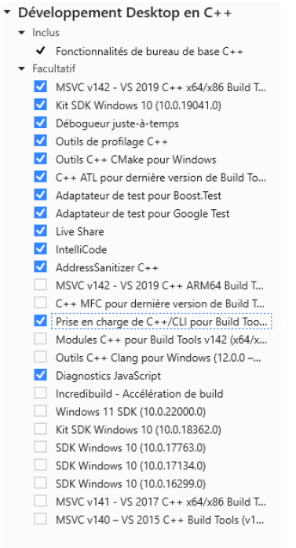
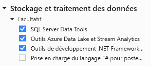

# kick-off C++ & GIT 🚀
> Dépôt de démonstration pour l'enseignement de la POO (en C++) combinée avec Git.


## Prérequis 


### ✅ Visual Studio 2019 Community Ed.
Le lien de téléchargement se trouve sur la plateforme Azure.


Avant de lancer l'installation, assurez-vous d'avoir sélectionné les options suivantes :




### ✅ SQL Server
Le lien de téléchargement se trouve sur la plateforme Azure.


### ✅ Microsoft SQL Server Management Studio


Le lien de téléchargement est ici ➡ [Télécharger SQL Server Management Studio (SSMS)](https://docs.microsoft.com/en-us/sql/ssms/download-sql-server-management-studio-ssms?view=sql-server-ver15)


### ✅ Visual PAradigm édition communautaire


Le lien de téléchargement est ici ➡ [Télécharger Visual Paradigm Ed. Communautaire](https://www.visual-paradigm.com/download/community.jsp)


## Phase 1 : Premier projet sous Visual Studio


Suivre la démonstration de l'enseignant ...


Voici le code "Hello World" que vous pouvez utiliser :


```cpp


#include <iostream>


int main()
{
    std::cout << "Hello World!\n";
}
```

Des exercices simples pour aborder la syntaxe ➡ [Exercices en langage C++ Developpez.com](https://cpp.developpez.com/tutoriels/exercice-corriges-ihm-debutant/)

## Phase 2 : Introduction à Git


### Etape 1 : Création d'un compte sur Github 🖊 


Inscrivez-vous à Github avec votre adresse scolaire. 


### Etape 2 : Connexion depuis visual studio 🖱


Suivre la démonstration de l'enseignant ...


### Etape 3 : Cloner un dépôt git depuis Visual Studio 📥


Lien vers le dépôt à cloner ➡ [lien vers le dépôt](https://github.com/quentinl-c/HelloWorldA2)


### Etape 4 : Créer un dépôt ... écrire du code .. l'enregistrer ... et le pousser sur le dépôt 📥


Suivre la démonstration de l'enseignant ...


### Etape 5 : Commencer à collaborer (optionnelle) 


### 📚 Ressoures :

* Cours : Introduction à Git
* [Doc complète en ligne](https://git-scm.com/doc)

## Phase 3 : Utilisation de SQL Server
> Suivre la démonstration de l'enseignant.

### Etape 1 : Connexion à SQL Server via MSQL Server Management


### Etape 2 : Création d'une base de données


### Etape 3 : Création d'une table


### Etape 4 : Création d'un utilisateur


### Etape 5 : Connexion via Visual Studio
[code à copier](https://gist.github.com/quentinl-c/23c85249a8007b3ba550dd57dcb8853d)


### Etape 6 : Communiquer avec la BD via ADO.NET


### 📚 Ressources :
* Doc d'installation fournie
* [Aperçu d'ADO.NET](https://docs.microsoft.com/fr-fr/dotnet/framework/data/adonet/ado-net-overview)

## Phase 4 : Notre première interface graphique

Suivre la démonstration de l'enseignant ...


### 📚 Ressources :
* [Create C++ Windows Forms application in Visual Studio 2017](https://social.msdn.microsoft.com/Forums/en-US/a9529502-6304-4aa6-90ee-0757ab258d87/create-c-windows-forms-application-in-visual-studio-2017?forum=winforms)
